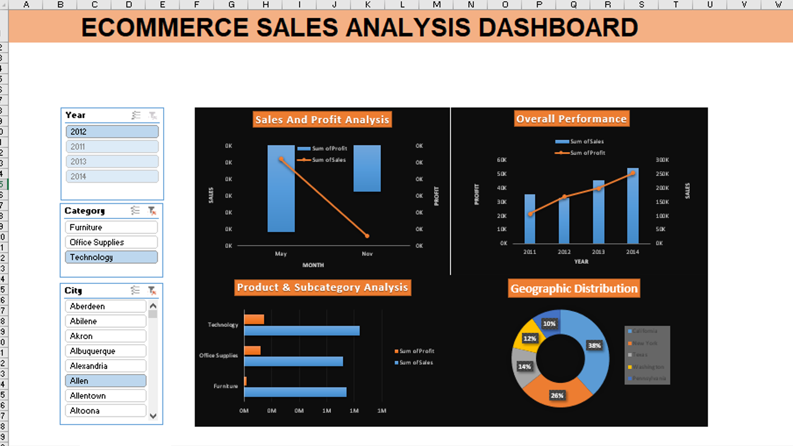

# IPL Stats Analysis

## Project Overview
This project analyzes IPL (Indian Premier League) data using Python, NumPy, Pandas, and Matplotlib. The goal is to explore player and team performance through data analysis and visualization.

## Project Screenshot



## Features
- Data cleaning and preprocessing
- Player performance analysis
- Team performance analysis
- Batting statistics
- Bowling statistics
- Data visualizations

## Technologies Used
- Python
- Pandas
- NumPy
- Matplotlib
- Google Colab

## How to Run
1. Open the notebook in Google Colab or Jupyter Notebook.
2. Install the required libraries if needed.
3. Run all cells to reproduce the analysis and visualizations.

## Project Structure
```text
IPL-Stats-Analysis/
├── README.md
├── Picture.png
└── IPL_Analysis.ipynb
