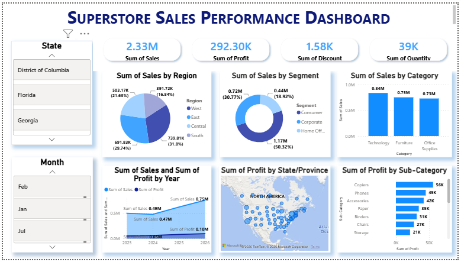

# 📊 Superstore Sales Performance Dashboard

## 📌 Project Overview

The **Superstore Sales Performance Dashboard** is an interactive Power BI project developed to analyze sales performance and provide meaningful business insights. The dashboard helps users monitor sales, profit, discounts, customer segments, product categories, and regional performance through interactive visualizations.

---

## 📷 Dashboard Preview



---

## 🎯 Objectives

- Analyze overall sales and profit performance.
- Compare sales across different regions and customer segments.
- Identify the best-performing product categories.
- Track yearly sales and profit trends.
- Support data-driven business decision-making.

---

## 🛠 Tools & Technologies

- Microsoft Power BI
- Power Query
- DAX (Data Analysis Expressions)
- CSV Dataset

---

## 📂 Dataset

- **Dataset:** Superstore Sales Dataset
- **Format:** CSV
- **Time Period:** 2023–2026

---

## 📈 Dashboard Features

- KPI Cards
  - Total Sales
  - Total Profit
  - Total Discount
  - Total Quantity

- Pie Chart
  - Sales by Region

- Donut Chart
  - Sales by Segment

- Column Charts
  - Sales by Category
  - Discount by Category

- Line Chart
  - Sales & Profit by Year

- Map
  - Profit by State

- Horizontal Bar Chart
  - Profit by Sub-Category

- Interactive Slicers
  - State
  - Month

---

## 📊 Key Insights

- South region generated the highest sales.
- Consumer segment contributed the highest revenue.
- Technology was the top-performing product category.
- Sales showed continuous growth over the years.
- Copiers generated the highest profit among all sub-categories.

---

## 💡 Skills Demonstrated

- Data Import using Power Query
- Data Visualization
- Interactive Dashboard Design
- DAX Calculations
- Business Intelligence Reporting

---

## 📁 Project Structure

```
Superstore-Sales-Performance-Dashboard/
│
├── Dashboard.png 
│
├── Power BI Superstore Sales Dashboard.pbix
│
├── Superstore.csv
│
└── README.md
```

---

## 👨‍💻 Author

**Rishav Thakur**

LinkedIn: *(Add your LinkedIn URL)*

GitHub: *(Add your GitHub Profile URL)*
